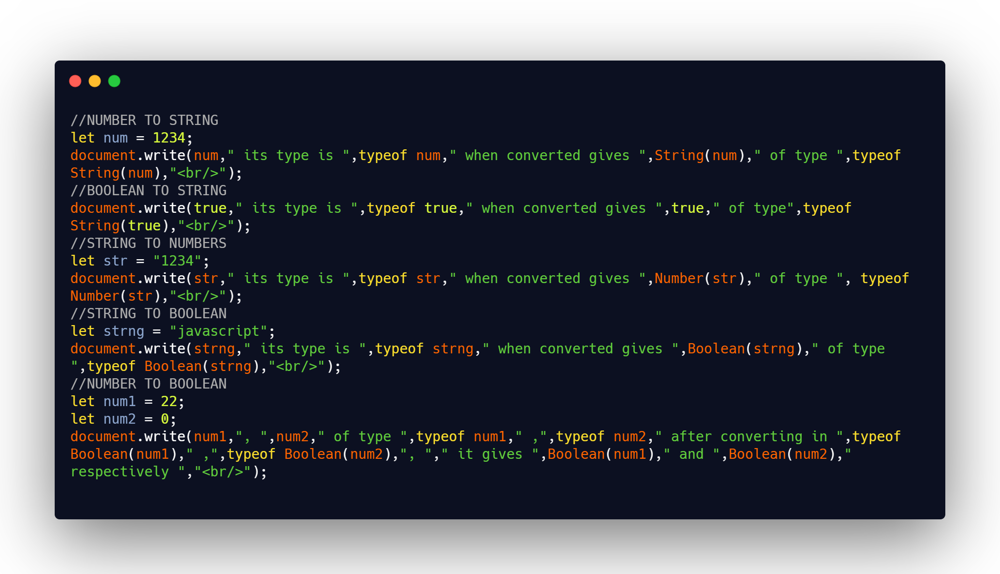

## DAY 1 (Type Conversion)

CODE SNIPPET FOR TODAY

You can use the typeof operator to find the data type of a JavaScript variable.

1. `String()`

   - The String() function converts the value of an object to a string.
   - It can convert date, objects, numbers... to string.
   - the argument object is required.
   - _String(object)_

2. `Number()`

   - The Number() function converts the object argument to a number that represents the object's value.
   - If the value cannot be converted to a legal number, NaN is returned.
   - the argument object is optional.
   - If no argument is provided, it returns 0.
   - _Number(object)_

3. `Boolean()`

   - It can only take the values true or false.
   - Boolean(14 > 8) // returns true
   - The Boolean value of "" (empty string) is false.
   - The Boolean value of 0 (zero) is false.
   - The Boolean value of undefined, NaN and null is false.
