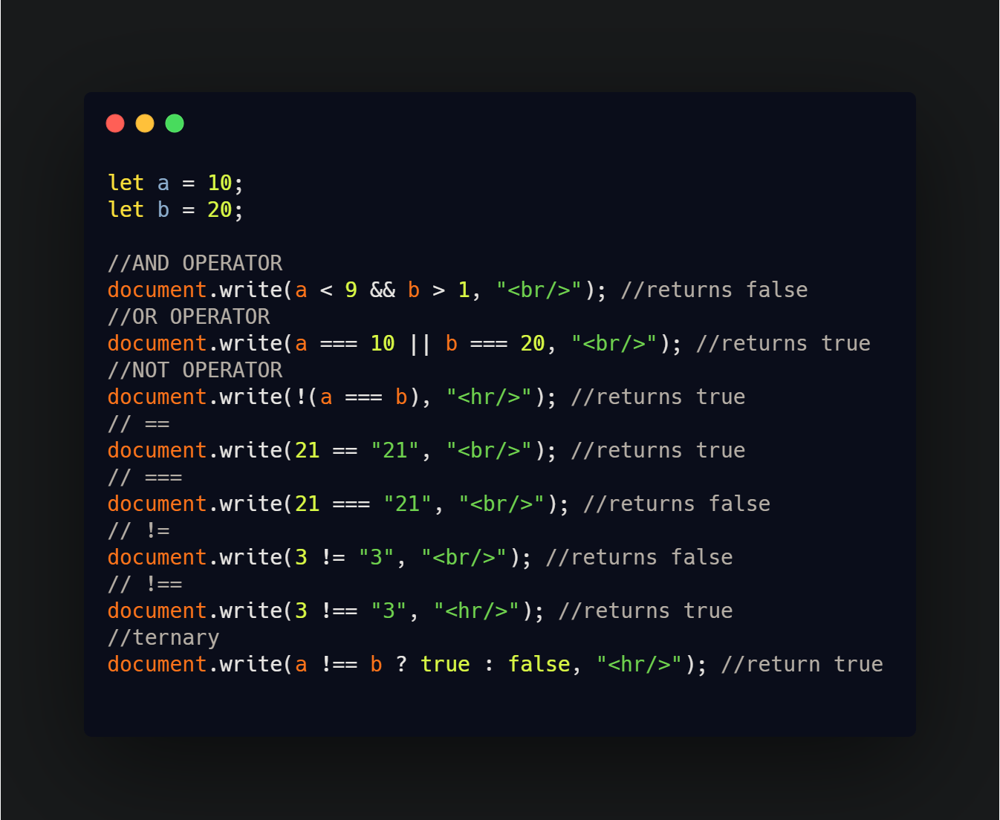

## DAY 2 (Logical Operators, comparison operators, ternary operator)

CODE SNIPPET FOR TODAY

1. **LOGICAL OPERATORS**

- `&&` OPERATOR

  - Evaluates operands from left to right.
  - For each operand, converts it to a boolean. If the result is false, stops and returns the original value of that operand.
  - If all operands have been evaluated (i.e. all were truthy), returns the last operand.
  - _syntax: value1 && value2 && value &&...._

- `||` OPERATOR

  - If any of its arguments result is true, it returns true, otherwise it returns false.
  - As we can see, the result is always true except for the case when both operands are false.
  - If an operand is not a boolean, it’s converted to a boolean for the evaluation.
  - For instance, the number 1 is treated as true, the number 0 as false
  - Evaluates operands from left to right.
  - _syntax: value1 || value2 || value ||...._

- `!` OPERATOR
  - Converts the operand to boolean type: true/false.
  - Returns the inverse value.
    - A double NOT !! is sometimes used for converting a value to boolean type
      alert( !!"non-empty string" ); // true, just like alert( Boolean("non-empty string") ); // true
  - The precedence of NOT ! is the highest of all logical operators, so it always executes first, before && or ||.
  - _syntax: !(value)_

2. **COMPARISON OPERATORS**

- `==` (equal to)
  - Returns true if the operands are equal.
  - _syntax: a == b_
- `===` (equal value and equal type)
  - Returns true if the operands are equal and of the same type.
  - _syntax: a === b_
- `!=` (not equal)
  - Returns true if the operands are not equal.
  - _syntax: a != b_
- `!==` (not equal value or not equal type)
  - Returns true if the operands are of the same type but not equal, or are of different type.
  - _syntax: a !== b_

3. **TERNARY OPERATORS**

- The conditional (ternary) operator is the only JavaScript operator that takes three operands: a condition followed by a question mark (?), then an expression to execute if the condition is truthy followed by a colon (:), and finally the expression to execute if the condition is falsy.
- _syntax: variablename = (condition) ? value1:value2_
