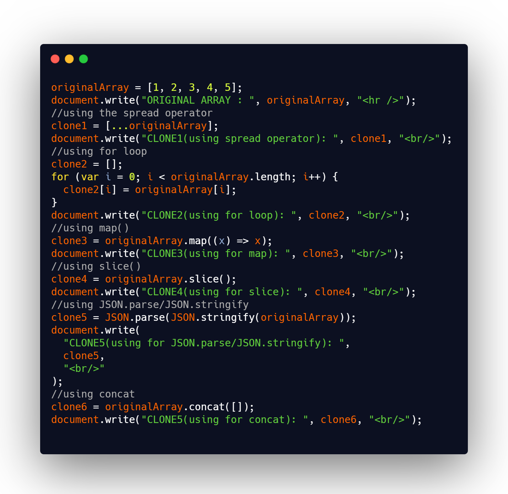

## DAY-07(cloning an array in different ways)

we cant copy an array with `=` because the problem with JavaScript is that arrays are mutable.
Arrays in JS are reference values, so when you try to copy it using the = it will only copy the reference to theoriginal array and not the value of the array. To create a real copy of an array, you need to copy over the valueof the array under a new value variable. That way this new array does not reference to the old array address in memory.
There are many ways we can copy an array.

### WAYS DISCUSSED IN THE JS CODE

1.  #### Spread Operator (Shallow copy)
    - Ever since ES6 dropped, this has been the most popular method.
    - This doesn’t safely copy multi-dimensional arrays. Array/object values are copied by reference instead of by value.
2.  #### for() Loop (Shallow copy)
    - good old way, was used mostly before ES6.
    - This doesn’t safely copy multi-dimensional arrays. Since you’re using the = operator, it’ll assign objects/arrays by reference instead of by value.
3.  #### map() (Shallow copy)
    - Array.map returns an array of the same length every single time.
    - This also assigns objects/arrays by reference instead of by value.
4.  #### slice() (Shallow copy)
    - slice returns a shallow copy of an array based on the provided start/end index you provide.
    - If we want all the elements, don’t give any parameters.
    - `slice(0,3)` means copy from index0 to 3.
    - This is a shallow copy, so it also assigns objects/arrays by reference instead of by value.
5.  #### JSON.parse and JSON.stringify (Deep copy)
    - JSON.stringify turns an object into a string.JSON.parse turns a string into an object.Combining them can turn an object into a string, and then reverse the process to create a brand new data structure.
    - **This one safely copies deeply nested objects/arrays!**
6.  #### Array.concat (Shallow copy)

    - concat combines arrays with values or other arrays.
    - If you give nothing or an empty array, a shallow copy’s returned.
    - This also assigns objects/arrays by reference instead of by value.

      **A deep copy means that all of the values of the new variable are copied and disconnected from the original variable. A shallow copy means that certain (sub-)values are still connected to the original variable.**
