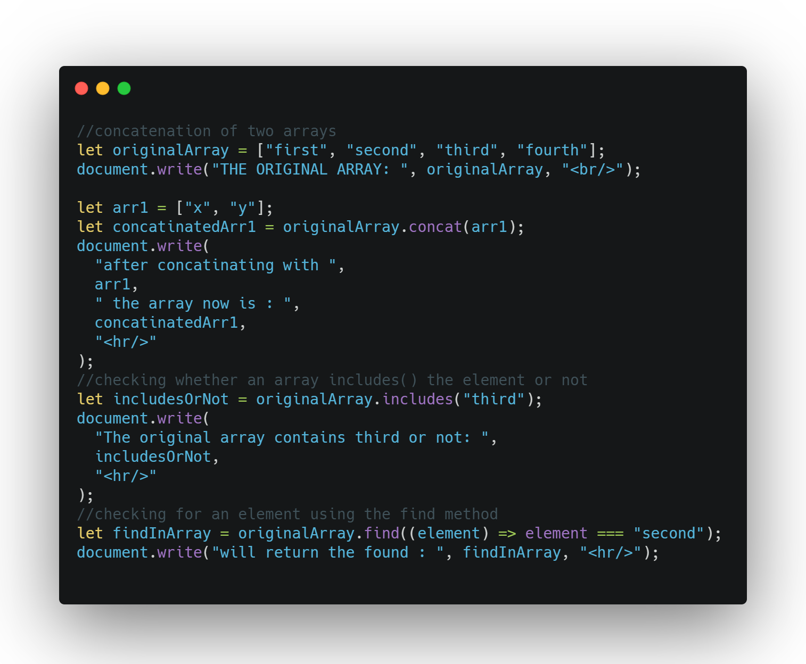

## DAY 10 (Array Methods part-1)

CODE SNIPPET FOR TODAY

Arrays provide a lot of methods. To make things easier, lets split into groups.

1. `concat()`

   - The concat() method is used to merge two or more arrays.
   - This method does not change the existing arrays, but instead returns a new array.
   - It accepts any number of arguments – either arrays or values.
   - Remember the original array doesnot gets changed by the concatenation method.
   - syntax: arr.concat(arg1, arg2...)

2. `includes()`

   - The includes() method determines whether an array includes a certain value among its entries.
   - Returns true or false as appropriate.
   - If fromIndex(optional) is negative, the computed index is calculated to be used as a position in the array at which to begin searching for valueToFind. If the computed index is less or equal than -1 \* arr.length, the entire array will be searched.
   - syntax: arr.includes(valueToFind[, fromIndex])

3. `find()`

   - The find method executes the callback function once for each index of the array until the callback returns a truthy value. If so, find immediately returns the value of that element.
   - Otherwise, find returns undefined.
   - If it returns true, the search is stopped, the item is returned. If nothing found, undefined is returned.
   - syntax: arr.find(function)
