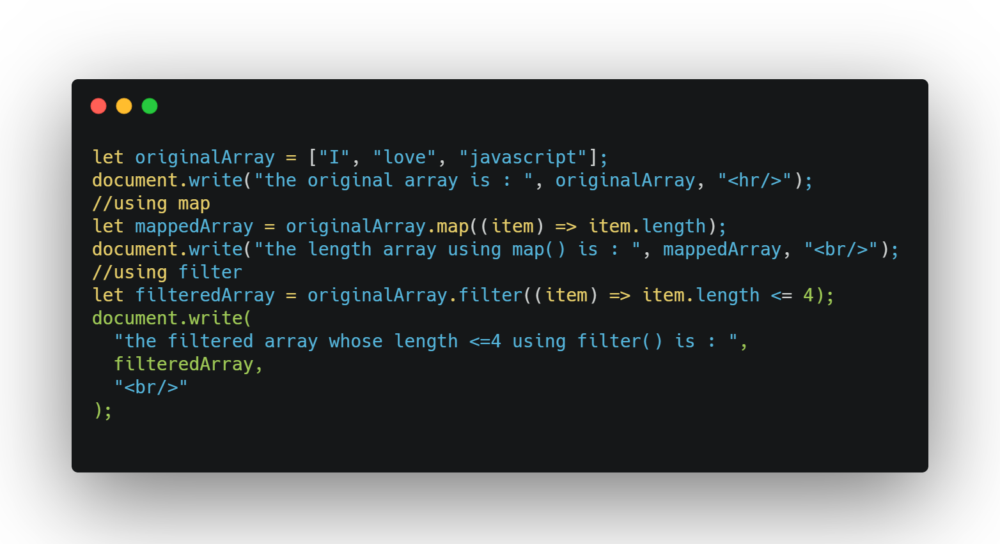

## DAY 11 (Array Methods filter , map)

CODE SNIPPET FOR TODAY

Arrays provide a lot of methods. To make things easier, lets split into groups.

1. `map()`

   - It calls the function for each element of the array and returns the array of results.
   - map calls a provided callback function once for each element in an array, in order, and constructs a new array from the results.
   - callback is invoked only for indexes of the array which have assigned values (including undefined).
   - returns a new array with each element being the result of the callback function.
   - syntax: let result = arr.map(callback func {
     // returns the new value instead of item
     });

2. `filter()`

   - The filter() method creates an array filled with all array elements that pass a test (provided as a function).
   - syntax: array.filter(function(currentValue, index, arr), thisValue)
