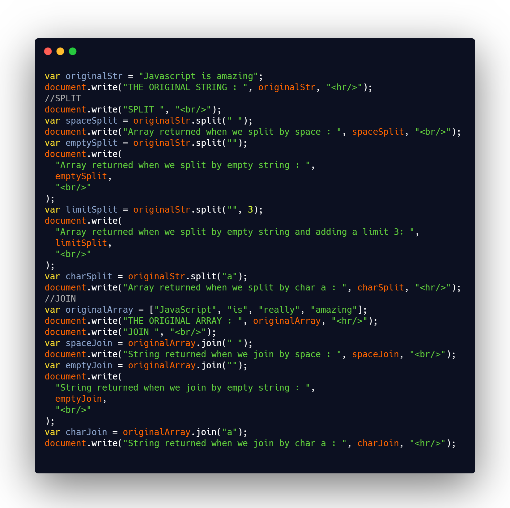

## DAY 12 (Array Methods split, join )

CODE SNIPPET FOR TODAY

Arrays provide a lot of methods. To make things easier, lets split into groups.

1. `split()`

   - The split() method is used to split a string into an array of substrings.
   - returns the new array.
   - The split() method does not change the original string.
   - An integer that specifies the number of splits, items after the split limit will not be included in the array.
   - if separator is omitted, the entire string will be returned (an array with only one item).
   - syntax: string.split(separator, limit) //separator and limit are optional.

2. `join()`

   - The join() method returns the array as a string.
   - The elements will be separated by a specified separator. The default separator is comma (,).
   - this method will not change the original array.
   - separator is optional if omitted, the elements are separated with a comma.
   - syntax: array.join(separator)

SPLIT -> STRING TO ARRAY
JOIN -> ARRAY TO STRING
