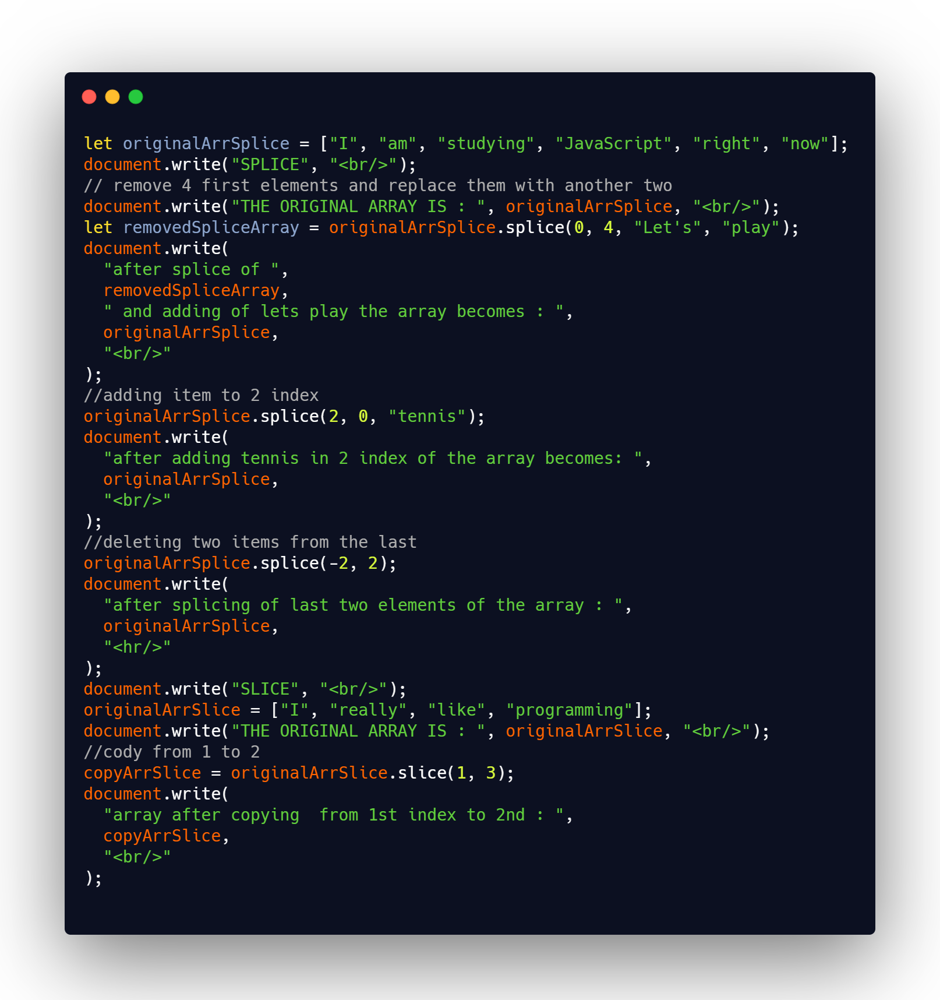

## DAY 13 (Array Methods splice, slice)

CODE SNIPPET FOR TODAY

Arrays provide a lot of methods. To make things easier, lets split into groups.

1. `splice()`

   - The splice() method adds/removes items to/from an array, and returns the removed item(s).
   - **This method changes the original array.**
   - Index is required. An integer that specifies at what position to add/remove items, Use negative values to   specify the position from the end of the array
   - howmany is optional. The number of items to be removed. If set to 0, no items will be removed,
   - item1, ..., itemX is optional. The new item(s) to be added to the array,
   - If you dont want to add new items then you can totally do that.
   - *syntax: array.splice(index, howmany, item1, ....., itemX)*

2. `slice()`

   - The slice() method returns the selected elements in an array, as a new array object.
   - **The original array will not be changed.**
   - It returns a new array copying to it all items from index start to end (not including end). Both start and end can be negative, in that case position from array end is assumed.
   - start index is optional. An integer that specifies where to start the selection (The first element has an index of 0). Use negative numbers to select from the end of an array. If omitted, it acts like "0".
   - end index is optional. An integer that specifies where to end the selection. If omitted, all elements from the start position and to the end of the array will be selected. Use negative numbers to select from the end of an array.
   - *syntax: array.slice(start, end)*
