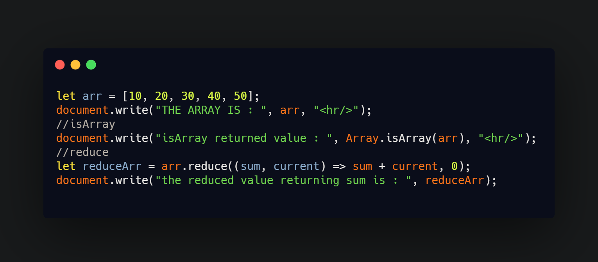

## DAY 14 (Array Methods reduce, isArray)

CODE SNIPPET FOR TODAY

Arrays provide a lot of methods. To make things easier, lets split into groups.

1. `reduce()`

   - The reduce() method reduces the array to a single value.
   - **this method does not change the original array.**
   - The reduce() method executes a provided function for each value of the array (from left-to-right).
   - The return value of the function is stored in an accumulator (result/total).
   - reduce() does not execute the function for array elements without values.
   - accumulator – it is required. Is the result of the previous function call, equals initial the first time (if initial is provided).
   - item – it is required. Is the current array item.
   - index – It is optional. Is its position.
   - array – It is optional. Is the array.
   - So, the first argument is essentially the accumulator that stores the combined result of all previous executions. And at the end it becomes the result of reduce.
   - _array.reduce(function(total, currentValue, currentIndex, arr), initialValue)_

2. `isArray()`

   - The isArray() method determines whether an object is an array.
   - **The original array will not be changed.**
   - This function returns true if the object is an array, and false if not.
   - _Array.isArray(obj)_
