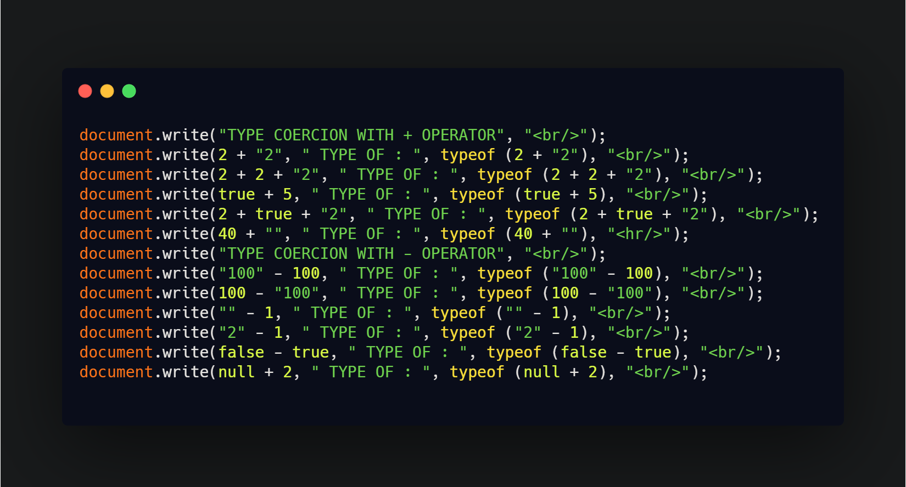

## DAY 15 (Type coercion (Part-1))

CODE SNIPPET FOR TODAY

Type coercion is the process of converting value from one type to another (such as string to number, object to boolean, and so on).

explicit type coercion is known as **type casting**.
The first rule to know is there are only three types of conversion in JavaScript:

- to string
- to boolean
- to number

**TYPE COERCION WITH + OPERATOR**

- remember if any of the value is a string JS converts it to string
- 2 + '2' //'22'
- 2 + 2 + '2' //'42'
- true + 5 //6
- 2 + true + '2' //'32'
- 40 + ""// '42'

**TYPE COERCION WITH - OPERATOR**

- usually tries to convert to a number nut not always
- '100' - 100 //0
- 100 - '100' //0
- '' - 1//-1
- '2' - 1//1
- false - true //-1
- null + 2 //2
