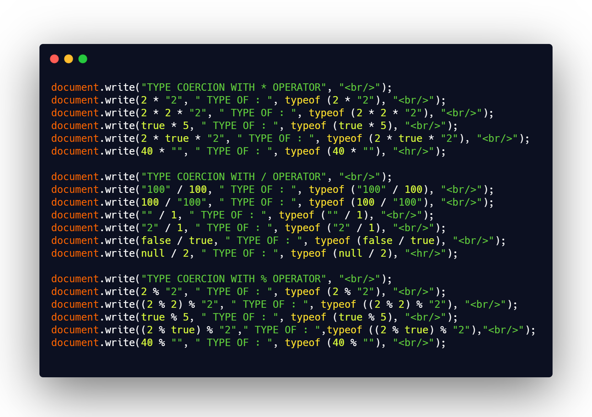

## DAY 16 (Type coercion (Part-2))

CODE SNIPPET FOR TODAY

Type coercion is the process of converting value from one type to another (such as string to number, object to boolean, and so on).

explicit type coercion is known as **type casting**.
The first rule to know is there are only three types of conversion in JavaScript:

- to string
- to boolean
- to number

**TYPE COERCION WITH \* OPERATOR**

- \* operator tries to convert the type to a number.
- 2 \* "2" //4 (reason: converts Number("2") so it becomes 2+2=4)
- 2 \* 2 \* '2' //8 (reason : 2 \* 2=4 , converts the '2' to number so now we have 4 \* '2' = 4 \* 2 = 8
- true \* 5 //5 (reason: true is treated as 1 so 5\*1 = 5)
- 2 \* true \* '2' //'4 (reason: true is treated as 1 so 2 /_ 1 =2 , 2 /_ '2' =4 (reason mentioned in previous examples))
- 40 \* ""// 0 (reason: Number("") gives 0 so 40\*0 = 0)

**TYPE COERCION WITH / OPERATOR**

- / operator usually tries to convert to a number
- '100' / 100 // 1 (reason: converts '100' to a number , Number('100') = 100, 100/100 = 1 )
- 100 / '100' // 1
- '' / 1//0 (reason : Number("") is 0 , 0/1=0)
- '2' / 1//2 (reason: Number('2') = 2 , 2/1 = 2)
- false / true //0 (reason: false is treated as 0 and true is treated as 1 , 0/1=0)
- null / 2 //2 (reason: Number(null)=0 , 0/2 = 0)

**TYPE COERCION WITH % OPERATOR**

- % operator usually tries to convert to a number
- 2 % "2"// 0 (reason: Number("2") = 2, so 2%2 = 0)
- (2 % 2) % "2" //0 (reason: Number("2") = 2, so 2%2 = 0, 0%2 = 0)
- true % 5 //1 (reason: true is treated as 1, 1%5 = 1)
- (2 % true) % "2" //0 (reason: true is treated as 1, 2%1 = 0 , 0%2 =0)
- 40 % ""//NaN (reason: Number("")=0, 40/0 is not a number)
