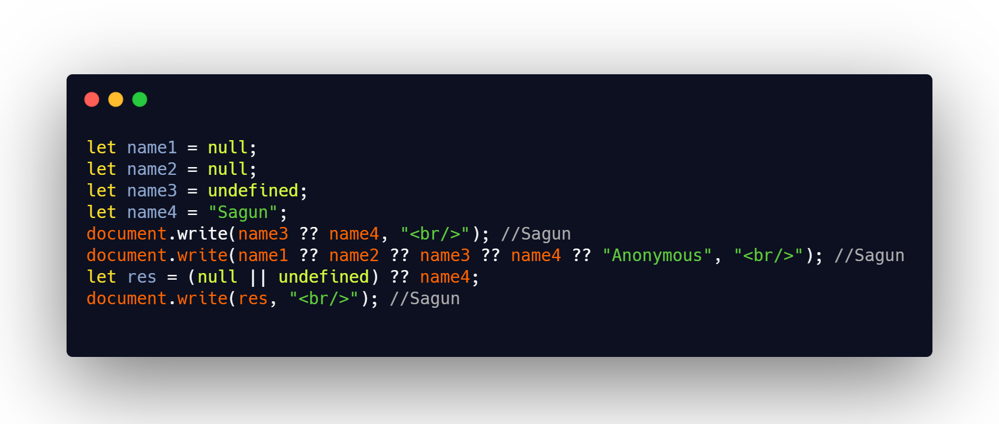

## DAY 17 (Nullish Coalescing Operator)

CODE SNIPPET FOR TODAY

**Nullish Coalescing Operator**

- This operator returns the right hand value if the left hand value is null or undefined.
- _no chaining with && and || operators_.It is not possible to combine both the AND (&&) and OR operators (||) directly with ??. A SyntaxError will be thrown in such cases.
  eg : null || undefined ?? "num"; // raises a SyntaxError
  (null || undefined) ?? "num"; // returns "num"

- You can use ternary for two values:
  variable = (x !== null && x !== undefined) ? x : y;

- for more than one values ?? comes in super effective
  let name = null;
  let regionalNAme = null;
  let nickName = "js";
  //it shows show the first not-null/undefined value
  document.write(name ?? regionalName ?? nickName ?? "Anonymous"); // js

- _difference between || and ??_
  || returns the first truthy value(except false, 0, -0, 0n, "", null, undefined, NaN every thing is truthy)
  ?? returns the first defined value.
  eg: let num = 0;
  console.log(num || 8); // 8  
   console.log(num ?? 8); // 0

- _syntax:variable??default_value_
