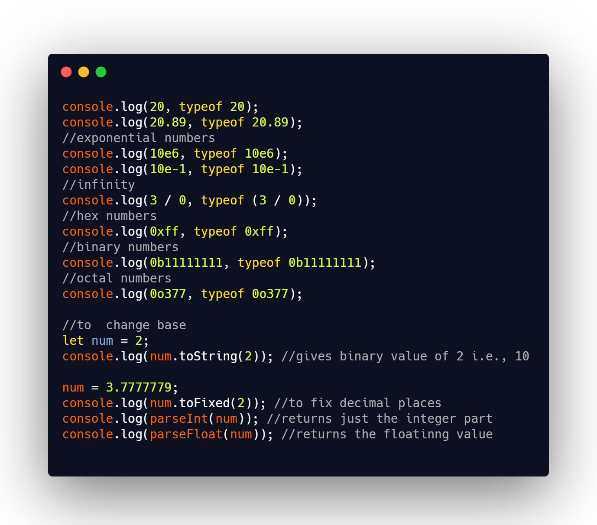

## DAY 18 (Data Types PART-1)

Lets dive deep into datatypes, to make our foundation strong!
JavaScript has seven types. Types are values that JavaScript can have. Below is a list of data types that JavaScript can have:

- Number
- String
- Boolean
- Undefined
- Null
- Object
- Symbol.

The Primitive Data types in JavaScript include Number, String, Boolean, Undefined, Null and Symbol.

For today we will learn about the Number data type.
CODE SNIPPET FOR TODAY

**A number data type can be an integer, a floating point value, an exponential value, a ‘NaN’ or a ‘Infinity’.**

_Writing bigger numbers_
In JavaScript, we shorten a number by appending the letter "e" to the number and specifying the zeroes count. eg: 1.2e3//1200

_writing HEX numbers_
Positive hexadecimals must begin with 0x and negative hexadecimals must begin with -0x. eg : 0xFF -0xCCFF

_writing octal numbers_
Positive octal numbers must begin with 0 (zero) followed by octal digit(s).
Negative octal numbers must begin with -0 followed by octal digit(s). eg.: 0o377

similarly for binary values as well.

Math.round(), Math.ceil, Math.floor are some useful functions to use as well.

_to change the base of a number_
`toString(basevalue)` is the function used.

refer to this site https://javascript.info/number for a much better explanation.
