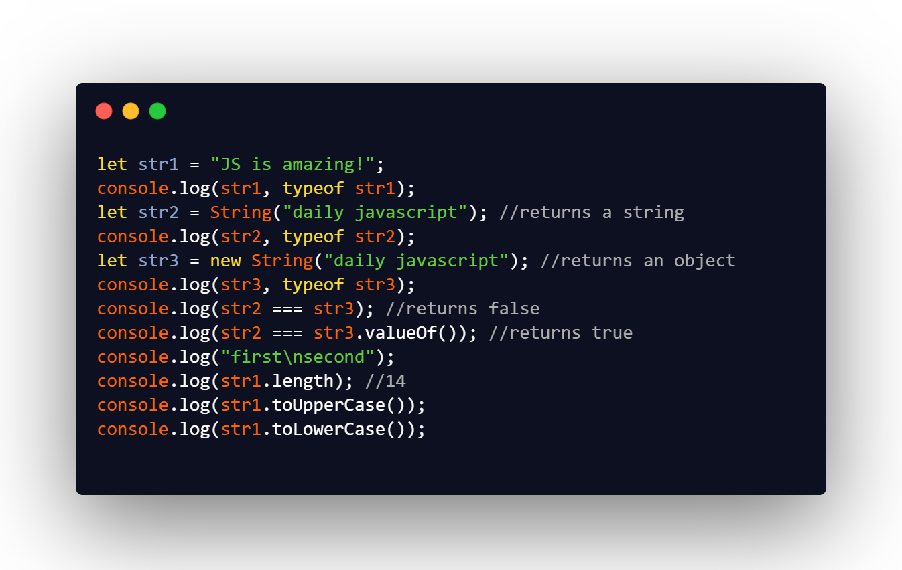

## DAY 19 (Data Types PART-2)

Lets dive deep into datatypes, to make our foundation strong!
JavaScript has seven types. Types are values that JavaScript can have. Below is a list of data types that JavaScript can have:

- Number
- String
- Boolean
- Undefined
- Null
- Object
- Symbol.

The Primitive Data types in JavaScript include Number, String, Boolean, Undefined, Null and Symbol.

For today we will learn about the String data type.
CODE SNIPPET FOR TODAY

- **Strings can be enclosed within either single quotes, double quotes or backticks.**

- Single and double quotes are essentially the same. Backticks, however, allow us to embed any expression into the string, by wrapping it in \${…}

  _Special Characters_

- It is still possible to create multiline strings with single and double quotes by using a so-called “newline character”, written as \n, which denotes a line break

  - \n New line
  - \r Carriage return: not used alone. Windows text files use a combination of two characters \r\n to represent a line break.
  - \', \" Quotes
  - \\ Backslash
  - \t Tab
  - \b, \f, \v Backspace, Form Feed, Vertical Tab – kept for compatibility, not used nowadays.

- `str.length` is a numeric property which gives the length of the string, not a function. There is no need to add parenthesis after it.

- JavaScript has a new keyword that we can use against a wrapper object to create Strings.

- if we create using new keyword. we need to use a String wrapper object’s function, named valueOf().
