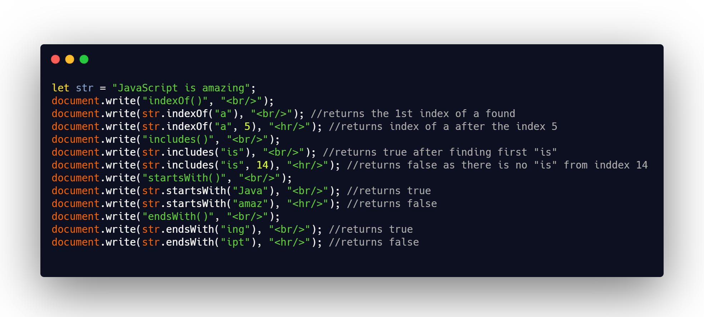

## DAY 20 (Data Types PART-3)

Lets dive deep into datatypes, to make our foundation strong!
JavaScript has seven types. Types are values that JavaScript can have. Below is a list of data types that JavaScript can have:

- Number
- String
- Boolean
- Undefined
- Null
- Object
- Symbol.

The Primitive Data types in JavaScript include Number, String, Boolean, Undefined, Null and Symbol.

For today we will learn about the String data type as well.
CODE SNIPPET FOR TODAY


- Strings can’t be changed in JavaScript. It is impossible to change a character.  
  eg:

```js
let str = "Sagun";
str[0] = "t";
\* gives error*\
```

- **comparing strings**

  - strings are compared character-by-character in alphabetical order.
  - A lowercase letter is always greater than the uppercase

- **playing with substrings**

  - `indexOf`

    - The indexOf() method returns the position of the first occurrence of a specified value in a string.
    - This method returns -1 if the value to search for never occurs.
    - The indexOf() method is case sensitive.
    - searchvalue is required. That is the string to search for.
    - start value is optional. Default is 0. At which position to start the search.
    - _syntax: string.indexOf(searchvalue, start)_

    - `includes()`

      - The includes() method determines whether a string contains the characters of a specified string.
      - This method returns true if the string contains the characters, and false if not.
      - The includes() method is case sensitive.
      - searchValue is required.
      - start index is optional is from where the search starts.
      - returns a boolean. Returns true if the string contains the value, otherwise it returns false
      - _syntax: string.includes(searchvalue, start)_

    - `startsWith()`

      - The startsWith() method determines whether a string begins with the characters of a specified string.
      - This method returns true if the string begins with the characters, and false if not.
      - The startsWith() method is case sensitive.
      - searchValue is required.
      - start index is optional is from where the search starts.
      - returns a boolean. Returns true if the string contains the value, otherwise it returns false
        - _syntax: string.startsWith(searchvalue, start)_

    - `endsWith()`
      - The endsWith() method determines whether a string ends with the characters of a specified string.
      - This method returns true if the string ends with the characters, and false if not.
      - The endsWith() method is case sensitive.
      - searchValue is required.
      - start index is optional is from where the search starts.
      - returns a boolean. Returns true if the string contains the value, otherwise it returns false
      - _syntax: string.endsWith(searchvalue, length)_

