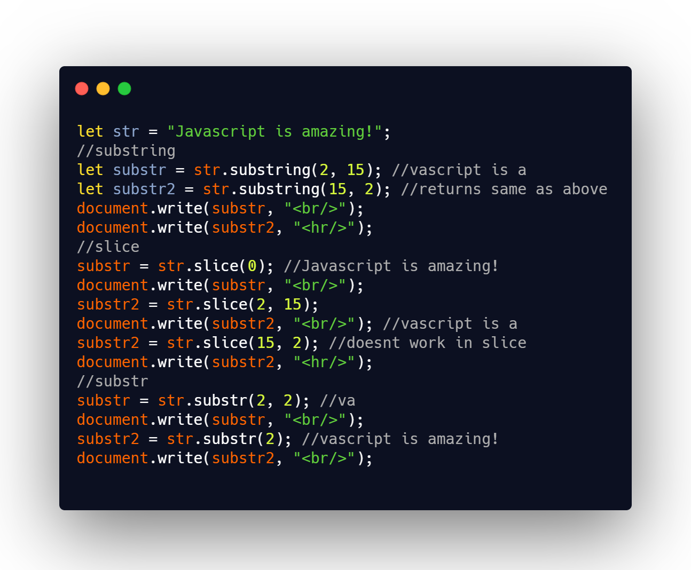

## DAY 21 (Data Types PART-4)

Lets dive deep into datatypes, to make our foundation strong!
JavaScript has seven types. Types are values that JavaScript can have. Below is a list of data types that JavaScript can have:

- Number
- String
- Boolean
- Undefined
- Null
- Object
- Symbol.

The Primitive Data types in JavaScript include Number, String, Boolean, Undefined, Null and Symbol.

For today we will learn about the String data type as well.
CODE SNIPPET FOR TODAY

There are various methods to get the sub-strings.

- `substring()`

  - The substring() method extracts the characters from a string, between two specified indices, and returns the new sub string.
  - This method extracts the characters in a string between "start" and "end", not including "end" itself.
  - If "start" is greater than "end", this method will swap the two arguments, meaning str.substring(1, 5) == str.substring(5, 1)
  - If either "start" or "end" is less than 0, it is treated as if it were 0.
  - The substring() method does not change the original string.
  - start index is required. The position where to start the extraction. First character is at index 0
  - end index is ptional. The position (up to, but not including) where to end the extraction. If omitted, it extracts the rest of the string
  - _syntax: string.substring(start, end)_

- `slice()`

  - The slice() method extracts parts of a string and returns the extracted parts in a new string.
  - Use the start and end parameters to specify the part of the string you want to extract.
  - The first character has the position 0, the second has position 1, and so on.
  - Use a negative number to select from the end of the string.
  - start index is required. The position where to begin the extraction. First character is at position 0
  - end index is optional. The position (up to, but not including) where to end the extraction. If omitted, slice() selects all characters from the start-position to the end of the string.
  - _syntax: string.slice(start, end)_

- `substr()`
  - The substr() method extracts parts of a string, beginning at the character at the specified position, and returns the specified number of characters.
  - **from start get length characters**
  - To extract characters from the end of the string, use a negative start number
  - The substr() method does not change the original string.
  - start index is required.The position where to start the extraction. First character is at index 0.
  - If start is positive and greater than, or equal, to the length of the string, substr() returns an empty string.
  - If start is negative, substr() uses it as a character index from the end of the string.
  - If start is negative or larger than the length of the string, start is set to 0
  - length is optional. The number of characters to extract. If omitted, it extracts the rest of the string
  - _syntax: string.substr(start, length)_

### out of the three methods slice mostly serves all purposes

