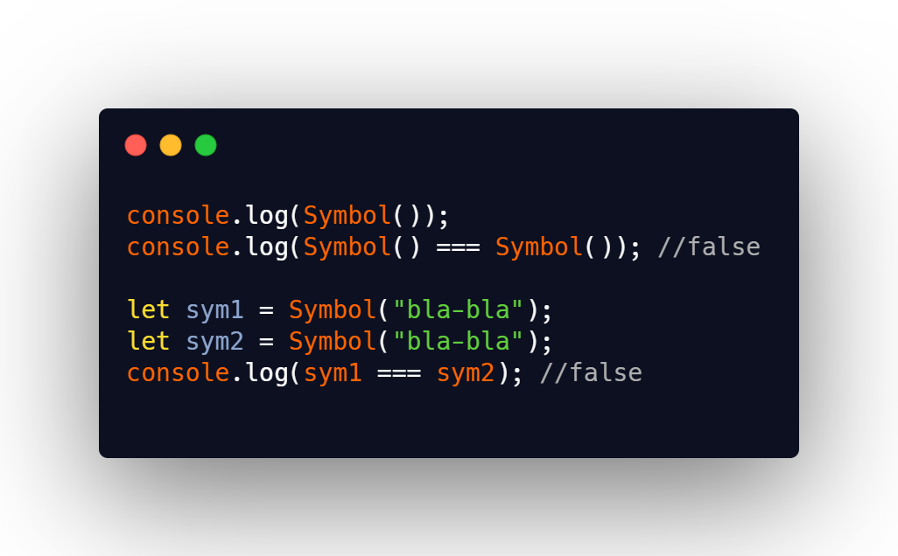

## DAY 22 (Data Types PART-5)

Lets dive deep into datatypes, to make our foundation strong!
JavaScript has seven types. Types are values that JavaScript can have. Below is a list of data types that JavaScript can have:

- Number
- String
- Boolean
- Undefined
- Null
- Object
- Symbol.

The Primitive Data types in JavaScript include Number, String, Boolean, Undefined, Null and Symbol.

For today we will learn about the Symbol data type(just the intro for today).
CODE SNIPPET FOR TODAY


**Symbol is the newest addition in the primitive data types in Javascript.**

- Once you create a symbol, its value is kept private and for internal use.
- Every time you invoke Symbol() we get a new and unique symbol, guaranteed to be different from all other symbols
  `Symbol() === Symbol()`//returns false
- ```js
  let sym1 = Symbol();
  let sym1 = Symbol();
  sym1 === sym2; //false
  ```
- You can pass a parameter to Symbol(), and that is used as the symbol description, useful just for debugging purposes, eg : `Symbol('anything')` but thats just helpful while debugging the functionality remains the same.

- A symbol is a primitive which cannot be recreated. In this case a symbols is similar to an object as creating multiple instances will result in values which are not exactly equal. But, a symbol is also a primitive in that it cannot be mutated.
