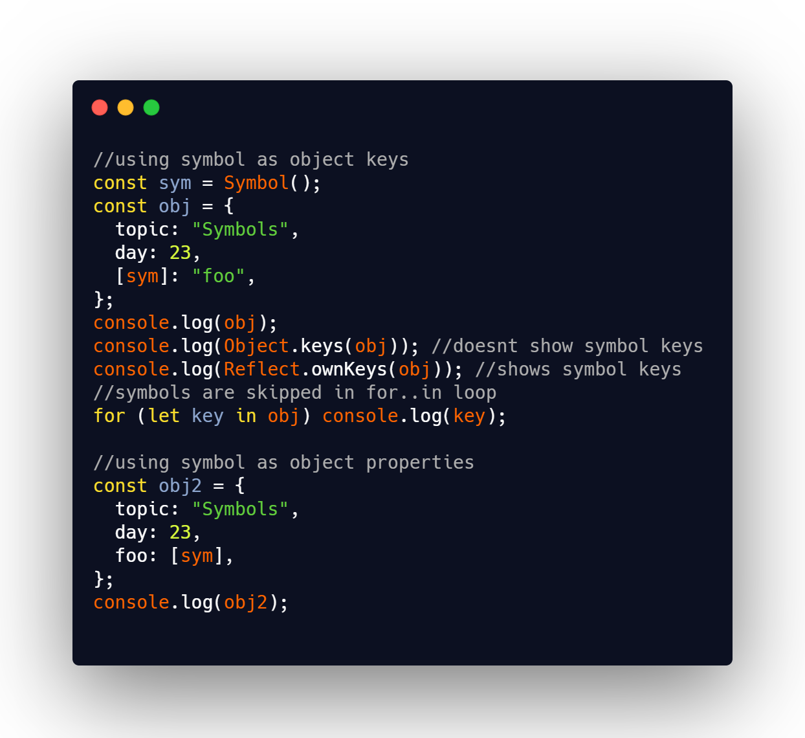

## DAY 23 (Data Types PART-6)

Lets dive deep into datatypes, to make our foundation strong!
JavaScript has seven types. Types are values that JavaScript can have. Below is a list of data types that JavaScript can have:

- Number
- String
- Boolean
- Undefined
- Null
- Object
- Symbol.

The Primitive Data types in JavaScript include Number, String, Boolean, Undefined, Null and Symbol.

For today we will learn about the Symbol data type(part2).
CODE SNIPPET FOR TODAY

- to assign symbol as a key of an object we have to enclose it in square brackets.

- Object.keys() doesnt show the Symbol key.

- But that doesnt mean those keys are "hidden", with the help of Reflect.ownKeys() we can see those keys.

- Symbolic properties do not participate in for..in loop.
