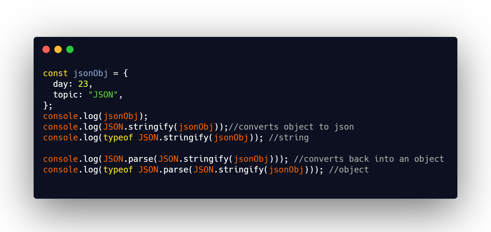

## DAY 24 (JSON)

Lets dive into a very useful topic today i.e., JSON.
CODE SNIPPET FOR TODAY

- JSON stands for JavaScript Object Notation.

- JSON is a lightweight data interchange format.

- **JSON is language independent.**

- JSON data is written as name/value pairs, just like JavaScript object properties.

- A name/value pair consists of a field name (in double quotes), followed by a colon, followed by a value.

- JSON objects are written inside curly braces. Just like in JavaScript, objects can contain multiple name/value pairs.

- JSON arrays are written inside square brackets. Just like in JavaScript, an array can contain objects.

- JavaScript methods :
  - JSON.stringify to convert objects into JSON.
  - JSON.parse to convert JSON back into an object.

