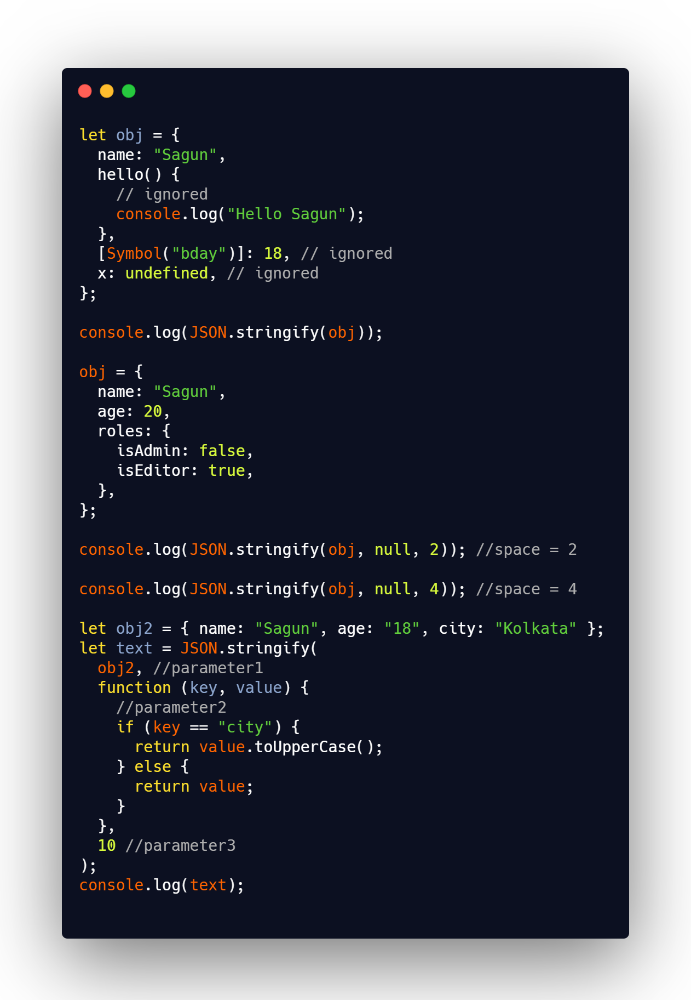

## DAY 25 (JSON part-2)

Lets dive into a very useful topic today i.e., JSON, and try to dive deep into it.

CODE SNIPPET FOR TODAY

- JSON is data-only language-independent specification, so some JavaScript-specific object properties are skipped by JSON.stringify.

  - Function properties (methods).
  - Symbolic properties.
  - Properties that store undefined

_Space formatting_

- The third argument of JSON.stringify(value, replacer, space) is the number of spaces to use for pretty formatting.
- Previously, all stringified objects had no indents and extra spaces. That’s fine if we want to send an object over a network. The space argument is used exclusively for a nice output.
 
 **more on JSON.stringify**
- _syntax: JSON.stringify(obj, replacer, space)_
- obj is required. The value to convert to a string
- replacer Optional. Either a function or an array used to transform the result. The replacer is called for each item.
- space parameter is optional. Either a String or a Number.
